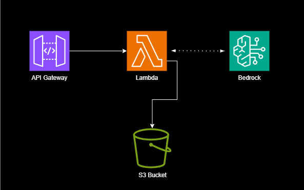

# ✍️ Blog Generator using Amazon Bedrock & AWS Lambda

## Overview  


This repository documents my experience building and deploying a **serverless blog generation system** powered by **Amazon Bedrock’s LLaMA3 model**, using **AWS Lambda** and **S3** for AI-driven content creation and storage. The workflow is triggered via **API Gateway**, enabling seamless blog post generation based on user-supplied topics. This solution is designed to be lightweight, modular, and production-ready with minimal operational overhead.

---

## 🔑 Key Benefits

- **AI-Powered Writing:** Automatically generates 50-word blog content from any topic using LLaMA3 via Bedrock.
- **Serverless Architecture:** Built on Lambda with no infrastructure to manage—fully scalable and cost-efficient.
- **Boto3 Layered Setup:** Uses a custom Lambda Layer to leverage the latest Boto3 and Botocore versions.
- **Secure & Reliable:** Configured with proper IAM permissions and exception handling for robustness.
- **Rapid API Access:** Integrated with API Gateway (POST method) for fast, programmatic access.
- **Storage Automation:** Output files are saved directly to S3 with timestamped filenames.

---

## ⚙️ Deployment Process

### 1. Code Development & Layer Setup
- Created a Python Lambda function that invokes Bedrock with a custom prompt.
- Deployed a Lambda Layer to bundle the **latest boto3 and botocore** libraries.

### 2. IAM Permissions
- Attached IAM policies to the Lambda role:
  - `bedrock:InvokeModel`
  - `s3:PutObject`
  - `logs:CreateLogGroup`, `logs:CreateLogStream`, `logs:PutLogEvents`

### 3. API Gateway Integration
- Integrated the Lambda function with **Amazon API Gateway**.
- Configured the route as `POST /generate-blog`.
- Set up request mapping to accept JSON with a `blog_topic` field.

### 4. Staging & Testing
- Created a **`dev` stage** for safe testing.
- Used **Postman** to invoke the endpoint with a request body like:
  ```json
  {
    "blog_topic":"Machine Learning and Generative AI"
  }
